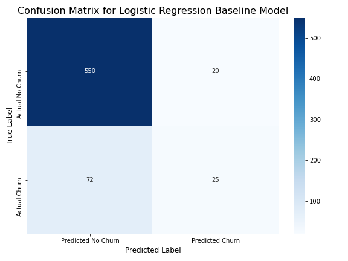
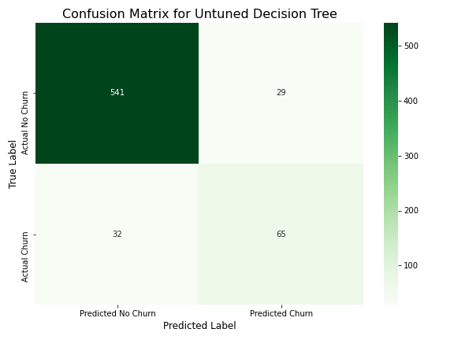

# Phase-3-Project / TELECOM ANALYSIS 
Project phase 3 AKADEMI Bootcamp of Antonine Pelicier ( Machine Learning / Predictive analysis / churn)

## Overview
This project presents a comprehensive data analysis of customer churn for a telecommunications company. By building and evaluating a predictive model, I aim to provide actionable insights to the Customer Retention Manager, enabling proactive strategies to reduce customer attrition. The project notebook details the entire workflow, from data preparation to final recommendations, serving as a bridge between the business problem and the technical solution.

## Business and Data Understanding
The core objective of this project is to predict which customers are at high risk of churning, a critical business problem as retaining existing customers is significantly more cost-effective than acquiring new ones. The primary stakeholder for this analysis is the Customer Retention Manager, who will use the model's output to identify at-risk customers and implement personalized retention campaigns.

The dataset, sourced from [BigMl](bigml_59c28831336c6604c800002a.csv) , contains 3,333 records and 21 columns of customer data, including demographics, service usage, and customer support interactions. This data provides the foundation for my predictive model, which learns the patterns and behaviors associated with customer churn.

## Modeling
To address the business problem, I used a supervised machine learning approach called classification modeling. This technique is ideal for problems where the outcome is a category or class, in this case, a customer either churns or does not churn. After thorough data preprocessing, including scaling numerical features and one-hot encoding categorical ones, I built a Decision Tree Classifier. To ensure the model was as accurate and reliable as possible, I used GridSearchCV to fine-tune its hyperparameters, such as max_depth and min_samples_leaf, to optimize its performance. The final, tuned model is what I used for my analysis and recommendations.

## Evaluation
Model evaluation is crucial for understanding a model's performance and its real-world implications. I used a confusion matrix to visualize the model's predictive accuracy. This matrix breaks down the model's predictions into four categories:

True Positives: Customers correctly predicted to churn.

True Negatives: Customers correctly predicted to stay.

False Positives: Customers incorrectly predicted to churn.

False Negatives: Customers incorrectly predicted to stay (a key metric to minimize in churn analysis).

## Visualizations
The project includes several visualizations to support the evaluation:

### Confusion matrix for logistic regression(baseline)

### Confusion matrix for the tuned confusion matrix model

### Visualisation of tuned decision tree

### Confusion matrix for the untuned confusion matrix model

### Visualization of Feature Importance
This chart visualizes which features were most important to my final model's predictions

This evaluation showed that the tuned model correctly identified 564 customers who would stay and 49 customers who would leave. While it incorrectly missed 39 customers who churned, its overall ability to identify at-risk customers provides a strong foundation for retention efforts.

## Conclusion
The analysis confirms that a well-tuned classification model can effectively predict customer churn. Our findings highlight two particularly important drivers of churn: customer service calls and the international plan. The number of customer service calls is strongly correlated with an increased churn rate, indicating underlying service issues. Similarly, customers with an international plan are significantly more likely to churn, suggesting potential dissatisfaction with the service or pricing structure for this group.

## Recommendations
Based on our findings, I propose the following actionable recommendations for the Customer Retention Manager:

#### Proactive Outreach: 
The model can generate a daily, prioritized list of high-risk customers, allowing the retention team to perform targeted outreach to prevent them from leaving.

 )
 
#### Investigate Service Issues:
Conduct a deeper analysis into the root causes of the multiple customer service calls to address systemic issues and improve the overall customer experience.

#### Review International Plan: 
Initiate a review of the international plan's features, pricing, and support to better understand why it is a major churn driver and implement necessary changes.

## Deliverables
Jupyter Notebook: [notebook_Phase3Project (.ipynb)](notebook_Phase3Project.ipynb) (and its PDF export).

Jupyter Notebook_pdf: [notebook (.pdf)](https://github.com/apelicier/Phase-3-Project/blob/main/Notebook/notebook.pdf)

Non-technical Presentation: [presentation (.pdf)](https://github.com/apelicier/Phase-3-Project/blob/main/Presentation/presentation.pdf)

GitHub Repository: [This repository itself](https://github.com/apelicier/Phase-3-Project)

GitHub Repository_pdf: [github (.pdf)](github.pdf)

#### Contact
[PELICIER Antonine]

[antoninepelicier10@gmail.com)]
